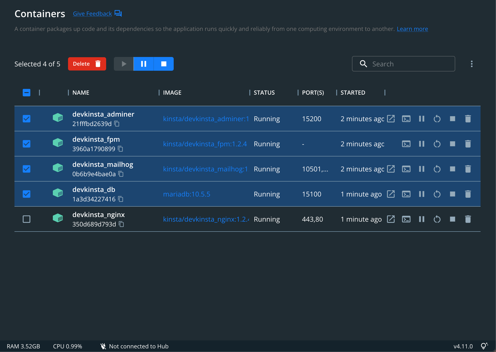

---

layout: default

title: "Thoughts Bin"

---

# Devkinsta ၊ Docker နှင့် Local PHP installation | Aug 2, 2022
</img>
အရင်တုန်းက Windows မှာ XAMPP, WAMP တို့နှင့် local PHP script install လုပ်ပြီး PHPMyadmin ကနေ MySQL Server ကိုချိတ်သုံးတဲ့ခေတ်ပေါ့။ ၂၀၀၇-၂၀၀၈ လောက်ကထင်တယ်၊ ကွန်ပြူတာထဲမှာ XAMPP သွင်းပြီး Joomla, Wordpress နဲ့ MediaWiki တို့လို့ script တွေ install လုပ်ပြီး လျှောက်ကလိတဲ့အချိန်ပေါ့။ Hosting, Domain ဆိုတာလည်း ဝယ်မသုံးနိုင်တော့ ကိုယ့်ကွန်ပြူတာထဲမှာ ကိုယ်ပိုင်အင်တာနက်ကမ္ဘာပါပဲ။ Website မျိုးစုံလျှောက်ထည့်ပြီး မိုးလင်းခဲ့တဲ့နေ့တွေ သတိရမိပါတယ်။
[Read More](devkinsta-docker.md)
