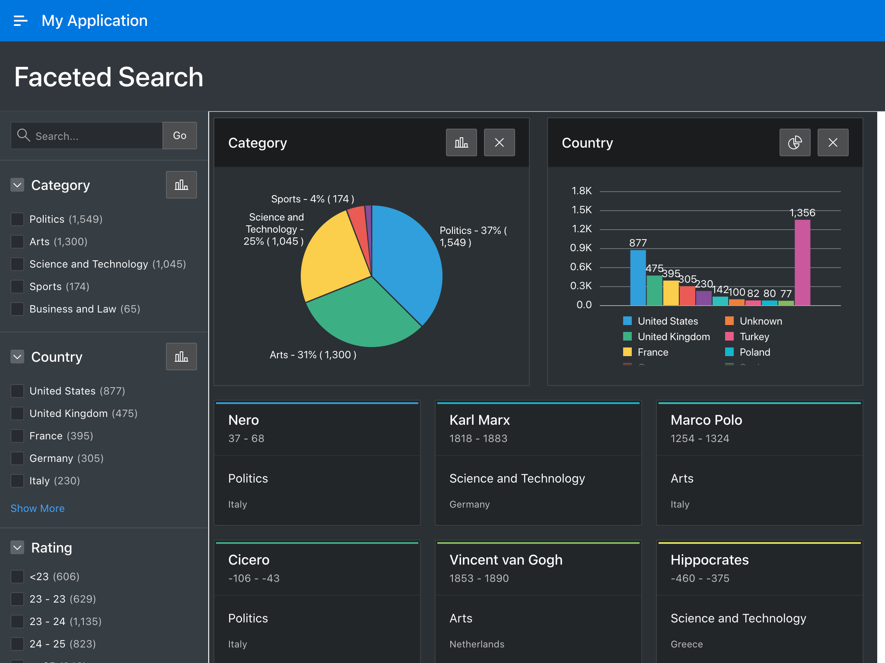
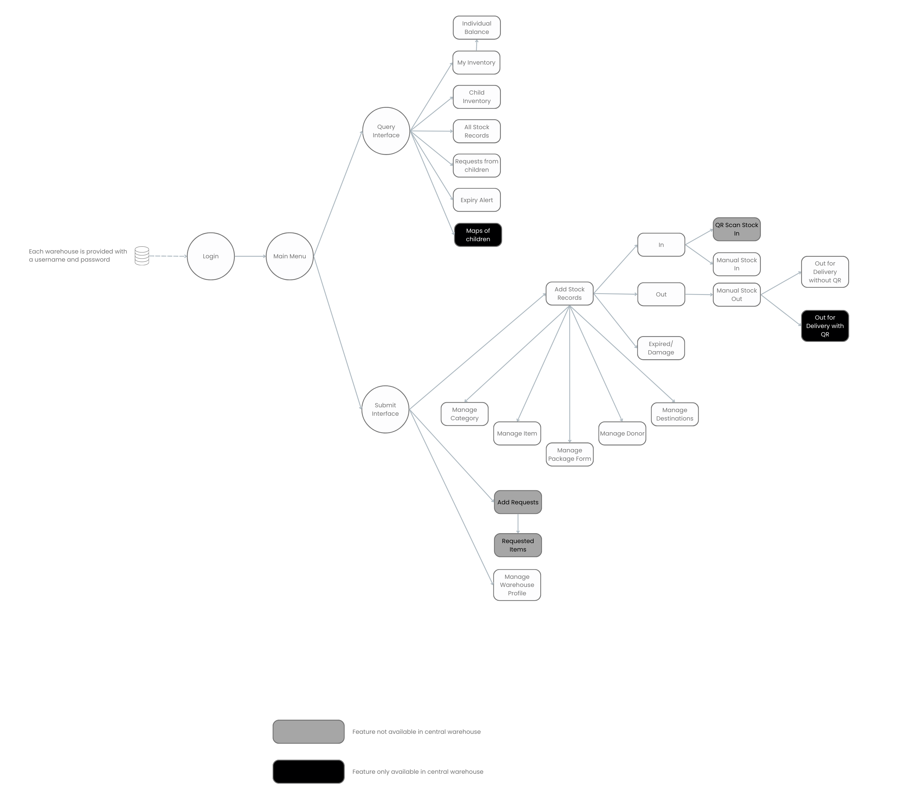

# CONSULTANCY REPORT
# September 31, 2022.

[toc]
***
# Executive Summary
## Objectives
* To continue setting up the online classroom for EHSSG
* To finish creating ```First Aid Care Training for Conflict Related Injuries``` online course
* To finish editing training material videos from ```First Aid Care Training for Conflict Related Injuries``` online course
* To create video animations relating to study materials for ```First Aid Care Training for Conflict Related Injuries``` online course
* To create accounts for students and assist in online course enrollment
* To supervise a new recruit for creating training videos
* To build a warehouse computer system and Logistic Management Information System (LMIS) for selected warehouses on Thailand-Burma border

## Outcomes
* A ```Logistic Management Information System``` (LMIS) is being developed underway
* ```First Aid Care Training for Conflict Related Injuries``` online course was continued creating with a majority of video materials
* Training material videos were continued editing
* Animated video clips are created to use in ```First Aid Care Training for Conflict Related Injuries``` online course
* __Six__ videos were created during September 2022:
1. Chapter03 Video06 ```Circulation Assessment``` ([View](https://drive.google.com/file/d/1qV_TZil3dx2361n9ZII0mvMs3bD99KVU/view?usp=sharing))
2. Chapter03 Video07 ```Pelvic Binder``` ([View](https://drive.google.com/file/d/1EFP6Jc6-NRWRAfu9ITCe_UY0ZLQqpwhY/view?usp=sharing))
3. Chapter03 Video08 ```Hypothermia and Head Injury``` ([View](https://drive.google.com/file/d/1Shhxt8orSHvhLj-jO1ltyKyBBcyKv265/view?usp=sharing))
4. Chapter04 Video01 ```Wound Care Algorithm``` ([View](https://drive.google.com/file/d/1EzDa-SwOkoeG6LLd8rJW-1gYF7oZ0gg6/view?usp=sharing))
5. Chapter05 Video01 ```Fracture``` ([View](https://drive.google.com/file/d/14-2gct1WxSwiHddpmdTndqFMfdYDfhIG/view?usp=sharing))
6. Chapter05 Video02 ```Splinting``` ([View](https://drive.google.com/file/d/1KiXqAVZtYZ17Asp_A23GlzdkZSVqGz0d/view?usp=sharing))

## Conclusions and Recommendations
* __A Logistic Management Information System (LMIS)__ is being developed and estimated beta testing phase should be started on first week of October. The EHSSG warehouse is going to be the first to test the beta system.
* EHSSG has started creating an online course on ```First Aid Care Training for Conflict Related Injuries``` and a ```Basic Course on Using Computer```.
    * ```First Aid Care Training for Conflict Related Injuries``` online course is not accepting students yet. The course is still under development. The development process is now faster with a new recruit.
    * The classroom needs to publicize to attract students after it is launched.
    * The ```Basic Course on Using Computer``` has been created and a batch of students from EHSSG's clinical supervisor internship training have completed the course.
* Target audience is inside Burma where internet is often cut.
    * Future online courses should include less video materials.
    * Existing video courses are pre-recorded and can be assessed at any time.
    * Videos should be made available to download.
* ```First Aid Care Training for Conflict Related Injuries``` online course raw materials need placeholder videos.
    * Though audio contents keep up the coverage of the scripts, there is not enough video contents to match the audio.
    * In future projects, the subject matter expert should provide a PowerPoint presentation to help the video editor create placeholder video during audio narration only clips.
* The script is the foundation of the entire project.
    * Once developed, the script should be made avilable to every team member of the project.
    * If the script had changes after it is created, the changes should be notified to every team member of the project. Otherwise, a team member would be creating content based on unused portion of the script.
    * The video presenter should use the **teleprompter** which was already purchased by EHSSG to reduce unnecessary time taken during recording and post-processing.
* Putting efforts during audio and video recording saves a lot of time during post-processing.
    * The entire post-processing time can be reduced with a script and following the script.
    * Rehersing the script helps get rid of mistakes during recording and reduces files clutter saving time taken for post-processing.
***
# Consultant Background
|Name|Dr. Ye Thi Ha Htwe|
|--|--|
|Education|M.B.,B.S(YGN)|
|Past Experiences|- Pharmacy Inventory Mobile Application<br />- Online Classroom with Moodle LMS|

***
# Abstract
## Logistic Management Information System (LMIS)
Warehouses on the Thailand-Burma border are working with minimal resources. The major goal of these warehouses is to store supplies and deliver on time to the necessary places in conflict regions of Burma. The Thai government authorities have not given official permission to cross the border from Thailand and bring medicine and related products into Burma. Funds allocated to the warehouses are mostly used for security and transportation rather than establishing a solid infrastructure and a properly managed system. And vice versa, inventory and logistic information of warehouses along the border has not been gathered with an organized system. EHSSG's focus has been shifted to establish an __Inventory and Logistic Management System__ not with the papers but  through a network.

Instead of buying a commercial ```Logistic Management Information System```(LMIS) with tons of extra features not in need at an expensive price, EHSSG chose to build a customized LMIS from scratch that matches the ground conditions of warehouses along the border. The entire ```Logistic Management Information System (LMIS)``` is going to be a cloud based installation which can be accessed through a web browser. Any devices with internet access will be able to login to the LMIS regardless of the screen sizes (Desktop, Laptop, Tablet or phone) and it is going to be platform independent. Devices with any Operating System (Windows, MacOS, ChromeOS, Linux, Android, iOS) will be able to access the cloud based system. Computer systems and internet access points will be installed in established warehouses, and those that do not yet have a fixed location will be assisted to use mobile devices.

## Online Classroom
EHSSG has already created an online classroom in ```https://ehssg.org/school/```.
The classroom uses the ```Moodle``` Learning Management System (LMS) installed in EHSSG's web hosting. The first course of the online classroom is ```First Aid Care Training for Conflict Related Injuries``` which is still under developement process. The major training materials of the course are videos which are 7 minutes to 10 minutes in average length.

Creating the videos basically needs ``scripting``, ``storyboarding``, ``audio recording``, ``video recording``, ``audio editing``, ``video editing``, ``animation``, ``joing audio-video-animation``, ``captioning`` and ``final cut``. The FACT course has finished its ``scripting``, ``storyboarding``, ``audio recording`` and ``video recording`` stages. The most time consuming stage of the process is audio editing, video editing and animation stages. In first week of September 2022, final cut videos for Chapter 3 out of 8 are realeased. The course contains 8 chapters and each chapter usually consists of 5 to 6 videos.

_Image:Homepage of EHSSG online school_

Once final cut videos are exported, the videos are uploaded to YouTube with ```Unlisted``` privacy option. When videos are hosted on YouTube with ```Unlisted``` privacy, the viewers with the link to the video can only access it. Any other users who enter the EHSSG's YouTube channel will not see any ```Unlisted``` videos. Videos are hosted on YouTube as YouTube offers chapters to be divided in a video from timestamps. Once a subtitle in English is attached to the video, automatic subtitle translation to other languages can be obtained as well. Videos hosted on YouTube are embedded in the pages of the online course reducing tons of storage space and traffic bandwidth to the EHSSG web hosting service [^1].

Each module of the course has a viewer restriction option which limits the user from viewing a particular sequel of the study material before viewing the initial foundation material. For example, module-2 of the course is not accessible unless the student has completed module-1.

_Image:Future modules are locked before completing first module_

Each Chapter usually starts with a **Pre-test** quiz which either consists of True/False or Multiple Choice Questions and ends with the same **Post-test** quiz. Though the **Pre-test** doesn't provide grades, the **Post-test** does grading on the students' performance.

_Image:A Quiz Page_

***
# 1.0 Introduction
## 1.1 Oracle Application Express (APEX)


_Image:An Oracle APEX application_

According to [apex.oracle.com](apex.oracle.com), ```Oracle Application Express``` (APEX) is a low-code development platform that enables building scalable, secure enterprise apps, that can be deployed anywhere. Using APEX, developers can quickly develop and deploy apps that solve real problems and provide immediate value.
Oracle database is a ```Relational Database Management System``` (RDBMS) similar to ```MySQL``` which is also owned by Oracle. Oracle database can be utilized for applications with large scale data and relational operations. It offers cloud based application development for free. Since ```Oracle APEX``` is a low code development platform, an existing knowledge of ```HTML```, ```CSS```, ```Javascript``` and ```MySQL``` is required to build full fledged applications.

The ```Logistic Management Information System```(LMIS) is being developed with ```Oracle APEX```.

## 1.2 Inventory Management System: a prototype of LMIS

Before developing a full fledged LMIS, an __Inventory Management System__ is created based on previous __Pharmacy Inventory Mobile Application__ developed by EHSSG.


_Image:The Wireframe of Inventory Management System_

### 1.2.1 Application Users

Rather than opened to public registration, the __Inventory Management Application__ could only be logged in with a provided ```Username``` and ```Password```. The ```Username``` is going to be permanently registered with the warehouse name and not likely to be edited. Each user account will be provided with a set up __Warehouse Profile__ which values can be edited later. The __Warehouse Profile__ contains an ```In Charge``` field which can be updated anytime with the name of the person managing the warehouse.


### 1.2.2 Landing Page and the Main Menu

The landing page or the home page of the application is a welcome page to see first once the user has logged in. The landing page is populated with the __Query Interface__ where existing inventory information is going to be displayed in charts, graphs and tables.

The Main Menu is populated with __Submit Interface__ where inventory information is submitted though different pages.

#### 1.2.2 (a) Query Interface

##### My Inventory
> __My Inventory__ page is populated with query information on inventory data of the warehouse linked to the user. The page is displayed in ```Cards``` Layout showing ```Item```, ```Category``` and ```Amount``` which can be filtered with __Search__, __Category__ and __Source__ (Donor). Filtered views for items with a defined __minimal stock amount__ and items closing to a defined __expiry date__ are likely to be created if required.

##### __Individual Balance__
> When a card populated with ```Item```, ```Category``` and ```Amount``` is clicked, the application will redirect the user to the _detail_ page of each ```Item``` where different inventory information on the same ```Item``` with different ```Batch Number```, ```Expiry Date``` and ```Source``` are displayed. The incoming and outgoing stock records will also be displayed in list view.

##### __Child Inventory__
> This page works the same as __My Inventory__ page but displays the inventory information of child warehouses. The database administrator of the __Inventory Management Application__ will manually define the hierarchy.

##### __All Stock Records__
> ```Stock In```, ```Stock Out```, ```Expired```, ```Damaged``` information for the current warehouse will be displayed in __All Stock Records__ page sorting with ```Date``` of the record. Like other report pages, the result can be filtered with __Category__, __Search__, and __Source__ (Donor).

##### Requests from Children
> The page displays information listing __Request Forms__ from child warehouses sorted with __Requested Date__. After clicking individual requests, it will be redirected to a detail page of the __Request Form__ including ```Requested Medicine``` and ```Average Monthly Consumption```.

##### Expiry Alert
> The __Main Menu__ of the application will show a notification icon and upon clicking, display a modal dialog page listing notifications. The __Expiry Alert Page__ is going to be redirected after clicking the expiry alert notification. The notification date to the impending expiry can be defined manually.

##### Maps of Children
> For statistical and management infromation, Geolocation of the service is necessary. Security concerns, however, prohibit disclosing the geolocation of the warehouses. The __Map of Children__ page is going to show a map locating warehouses along the border as much information available.

#### 1.2.2 (b) Submit Interface

##### Add Stock Records
> All types of stock records can be filled in this page. ```Stock In```, ```Stock Out```, ```Expired```, ```Damage``` information can be selected from a Dropdown menu.
> From __Manage Category__ page, the user can add or remove __Category__ of the item.
> __Manage Item__ page allows the user to add or remove an __Item__ to or from the list populating the Item Dropdown menu.
> __Manage Package Form__ lets the user to edit __Package Form__ list where __Package Form__ Dropdown menu loads its data.
> __Manage Donor__ page is where the user can edit the list of donors.
> At__Manage Destination__ page, the user can edit the delivery destination of each item.

##### Request Forms
> Only child warehouses can submit request forms. This information is not only for statistical purposes, the requested data is automatically delivered to the respective parent warehouse.

##### Manage Warehouse Profile
> Any changes to the data collecting person such as __Name__, __Location__, __Geolocation__ can be edited in this page.

#### 1.2.3 Data Ownership
__EHSSG__ may have access to the Database during initial set up and technical support period. Once the data collecting persons and database administrators, after proper and thorough training, are able to operate independently, the ownership of the copy of the __Inventory Management Application__ and the __Database__ will be provided to individual organizations.
The information from the Database can be backed up by downloading, printing and sending to Email.

## 1.1 Moodle Learning Management System

**Moodle** is an online Learning Management System (LMS) that can be installed in moodlecloud or private websites. The course contents are dynamic and can be accessed anytime and anywhere around the world. Students' progress can be monitored inside the portal and assessments can also be carried out online on the same platform. Communication between the teachers and students can also be done thorugh forums and discussions. When the students completed and or passed the course, certificates can be generated automatically and students will be able to download or save the certificate.

_Image:Moodle LMS_

Several types of study materials can be provided in **Moodle** LMS. Not only videos, pages, interactive contents, flash cards, quizzs, lessons, live teaching and audios can be provided as well.
Students have to follow a self-paced-learning and live-teaching, if prefered, can also be utilized.
**Moodle** LMS can be started from **Moodle**'s own moodlecloud or the script can be downloaded and installed in own hosting services.[^2]

## 1.2 Instructor-Led vs Self-Paced Learning Modalities
``Instructor-led Courses`` are for students who prefer a structured learning pace with instructor support. Lessons are gated and released from the instructor at its own pace. 
``Self-paced Tutorials`` are for students who prefer to learn at their own pace and are comfortable with self-guidance. Students gain access to all course material, quizzes and the final exam at the time of enrollment.

__Comparison Table of Instructor-Led vs Self-Paced Learning__
||Instructor-Led|Self-Paced|
|--|--|--|
|Course start|Specified by Instructor|Started by the student|
|Duration|Specified by Instructor|Depends of the student's own pace of learning|
|Instructor Led|Yes|No|
|Discussion|Peer to peer and Peer to Instructor|Peer to Peer|
|Content Access|As provided by Instructor|Available upon completion|
***
# 2.0 Project Approach
Since the online course mainly consists of videos, the process is as follows:
* ``Scripting``
* ``Storyboarding``
* ``Audio recording``
* ``Video recording``
* ``Audio Editing``
* ``Video Editing``
* ``Animation``
* ``Joining Audio-Video-Animation``
* ``Captioning``
* ``Final Cut``

## 2.1 Scripting
Scripting for a video project is usually created based on the teaching material. A script helps video creators how to set up a video shooting environment and how to record audio narrations. Script is usually done by the subject matter expert of a training subject.

_Image:Script of a chapter in First Aid Care Training for Conflict Related Injuries_

## 2.2 Storyboarding
Script is converted to storyboard which is a visualized version and from which, it saves time shooting videos and helps creating animations. Storyboards were created using premade templates and or in markdown format.

_Image:A storyboard of the project_

## 2.3 Audio recording
Audio recording is usually necessary for narrations. Audio recording is based on script and again, it needs to follow the script. Once an extra line is added  during recording, another person or team working on their content based on the original script will produce the unaltered material. That will eventually have discrepencies in final output.

## 2.4 Video Editing
Cutting videos is the first step of video editing where unnecessary video clips are discarded. If the video recording followed the script, there will be less wasted videos clips and could eventually save time during editing. Adding file names next to the script saves enormous amount of time during post-processing. Video clips with cut ends usually have abrupt transition from one scene to another making the video looks unprofessional. So it is crucial to have one single cut from the beginning to the end of the scene.
Video editing is done through __Final Cut Pro X__ and __Cyberlink Power Director__.

_Image:Post-processing environment in Final Cut Pro X_

## 2.5 Audio Editing
Audio Editing is mainly done with two applications; **Audacity** and **Izotope RX9**. Audio recordings usually include silent intervals when the speaker usually stops speaking during thinking what to speak next. These silent intervals cumulatively add a certain amount of time to the length of the final cut so they need to cut to sound like natural pause. Noises from the air-con and fan often disturb the recording in a uniform rumbling noise from start to end. This is where audio editing comes in. **Audacity** has a truncate silence function which intuitively drops silent intervals at a user specified threshold. This leaves a rather straight forward audio clip and then it is imported to Izotope RX9 to remove clipping and background noise. The final audio clip is then imported to **Final Cut Pro X**.

_Image:Audio post-processing environment in iZotope RX9_

## 2.6 Animation
Animation is made with **Adobe Animate**. Adobe Animate is previously Adobe Flash which was obsolete. With the rise of HTML5 technology, Adobe Flash became **Adobe Animate** and works with vector images to create animations. Interactive learning materials can also be created with **Adobe Animate** and exported to HTML5 format which can be embedded in webpages. For educational videos, frames in Animate are exported to MPEG4 format and imported to **Final Cut Pro X**.

_Image:Animation environment in Adobe Animate CC_

## 2.7 Joining Audio-Video-Animation
Narrated audio clips and animated video clips are merged in **Final Cut Pro X** where all scenes join.

## 2.8 Captioning
With **Final Cut Pro X**'s title feature, titles and captions are added to the merged and joined footages.

## 2.9 Final Cut
Color grading is the final step of the post-processing. Since not all video clips were created with equal color temperature and lighting set up, a final color grading to match the theme of the video and to have a consistent color temperature throughout the video.
***
# 3.0 Project Outcomes
* "First Aid Care Training for Conflict Related Injuries" online course was continued creating with a majority of video materials
* Training material videos were continued editing
* Animated video clips are created to use in "First Aid Care Training for Conflict Related Injuries" online course
* <<EDIT LATER>> videos were created during September 2022:
1. Chapter03 Video06 ```Circulation Assessment``` ([View](https://drive.google.com/file/d/1qV_TZil3dx2361n9ZII0mvMs3bD99KVU/view?usp=sharing))
2. Chapter03 Video07 ```Pelvic Binder``` ([View](https://drive.google.com/file/d/1EFP6Jc6-NRWRAfu9ITCe_UY0ZLQqpwhY/view?usp=sharing))
3. Chapter03 Video08 ```Hypothermia and Head Injury``` ([View](https://drive.google.com/file/d/1Shhxt8orSHvhLj-jO1ltyKyBBcyKv265/view?usp=sharing))
4. Chapter04 Video01 ```Wound Care Algorithm``` ([View](https://drive.google.com/file/d/1EzDa-SwOkoeG6LLd8rJW-1gYF7oZ0gg6/view?usp=sharing))

***
# 4.0 Conclusions and Recommendations
* EHSSG has started creating an online course on ```First Aid Care Training for Conflict Related Injuries``` and a ```Basic Course on Using Computer```.
    * ```First Aid Care Training for Conflict Related Injuries``` online course is not accepting students yet. The course is still under development. The development process is now faster with a new recruit.
    * The classroom needs to publicize to attract students after it is launched.
    * The ```Basic Course on Using Computer``` has been created and a batch of students from EHSSG's clinical supervisor internship training have completed the course.
* Target audience is inside Burma where internet is often cut
    * Future online courses should include less video materials.
    * Existing video courses are pre-recorded and can be assessed at any time.
    * Videos should be made available to download.
* ```First Aid Care Training for Conflict Related Injuries``` online course raw materials need placeholder videos
    * Though audio contents keep up the coverage of the scripts, there is not enough video contents to match the audio
    * In future projects, the subject matter expert should provide a PowerPoint presentation to help the video editor create placeholder video during audio narration only clips.
* The script is the foundation of the entire project
    * Once developed, the script should be made avilable to every team member of the project.
    * If the script had changes after it is created, the changes should be notified to every team member of the project. Otherwise, a team member would be creating content based on unused portion of the script.
    * The video presenter should use a __teleprompter__ which was already purchased by EHSSG to reduce unnecessary time taken during recording and post-processing
* Putting efforts during audio and video recording saves a lot of time during post-processing.
    * The entire post-processing time can be reduced with a script and following the script
    * Rehersing the script helps get rid of mistakes during recording and reduces files clutter saving time taken for post-processing.
    
    _Image:Teleprompter_
***
# 5.0 Glossary
[^1]: Videos usually take a large amount of storage space in a web hosting. Most web hosting services are subscribed to premium hosting plans but it is a good practice to host photos and videos in another third party services in case of primary hosting server failure or an unexpected subscription cancels.
[^2]: Moodle is written in PHP language and uses MySQL database making it availabe to be installed on own private web servers. Moodlecloud is Moodle's own cloud hosting service where Moodle is already installed and instantly utilized.

|Keyword|Description|
|--|--|
|EHSSG|Ethnic Health System Strengthening Group|
|FACT|First Aid Care Training for Conflict Related Injuries|
|NPA|Nasopharyngeal Airway|
|HTML5|Hypertext Markup Language version-5|
***
# 6.0 References
|Item|Reference URL|
|--|--|
|EHSSG Homepage|https://www.ehssg.org|
|EHSSG Online Classroom|https://www.ehssg.org/school/|
|Moodle LMS|https://moodle.org|
|Chapter03 Video03 NPA|[View](https://drive.google.com/file/d/1cAvPJBGzCGUpC1AxK2fm9AiIi07rZIjL/view?usp=sharing)|
|Chapter03 Video04 Respiratory Assessment|[View](https://drive.google.com/file/d/1rjmZ02APTkVj5CxRVzfe9sgI-lsJ2O8u/view?usp=sharing)|
|Chapter03 Video05 Chest Seal|[View](https://drive.google.com/file/d/1coa6tyeIIB3V6f8oqd3qFSln6Kj8HUGw/view?usp=sharing)|