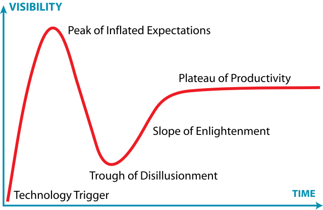

ခရီးသွားဟန်လွဲဖတ်ဖူးတဲ့စာတွေက ဘယ်နေရာအသုံးဝင်မလဲ မသိပေမယ့် ငြင်းကြခုံကြပြီဆိုရင် ပါးစပ်ထဲကရုတ်တရက်ထွက်ထွက်လာတယ်။ ပုံမှန်အချိန်ဆို သတိမရတဲ့ အချက်တွေကငြင်းပြီဆိုရင် ခုန်ပေါက်ထွက်လာကြတာမျိုး။
ဒီနေ့လည်း ငြင်းခုံရင်းထွက်လာတဲ့ quote နှစ်ခုရှိတယ်။
>
“Modern problems require modern solutions”.

ဒါကတော့ meme တွေမှာတွေ့နေကျ။ နည်းပညာစာအုပ်တစ်ခုမှာလည်း ဒါကို quote လုပ်ထားတာရှိတယ်။ ဘယ်စာအုပ်လဲတော့ အတိအကျမမှတ်မိတော့ဘူး။
ဒါနဲ့ဆက်စပ်ပြောရရင် **"Legacy code is like paying rent on a property you don't live in anymore"** ဆိုတဲ့ quote ကို programming နဲ့ပတ်သတ်တဲ့ discussion တွေမှာ မကြာခဏတွေ့ရတယ်။ Legacy code ဆိုတာ ခေတ်ဟောင်းနေတဲ့ code တွေပေါ့။ ပရိုဂရမ်းမင်းဘာသာစကား ဗားရှင်းအနိမ့်တွေတုန်းက ရေးထားခဲ့တဲ့ code တွေဟာ ဗားရှင်းအသစ်တွေထွက်လာရင် လိုက်ပြင်ရေးပေးဖို့လိုတယ်။ code မပြင်ချင်လို့ စနစ်သစ်ကို upgrade မလုပ်တာဟာ အရှိန်အဟုန်နဲ့ပြေးနေတဲ့ နည်းပညာလောကမှာ တော်တော်ကြီးပြတ်ကျန်ခဲ့တတ်တယ်။ system upgrade တော့လုပ်ပါရဲ့၊ code ဟောင်းတွေမပြင်ဘဲ system အသစ်မှာအလုပ်ဆက်လုပ်အောင် ကြားခံ code တွေထပ်ရေးပေးတာဟာလည်း လူမနေဘဲအိမ်ငှားခပေးနေရသလိုပါပဲ။
ဒီနေ့လို AI တွေမှိုလိုပေါက်အောင် ပေါများနေတဲ့ခေတ်မှာ နည်းပညာကိုအမီလိုက်ဖို့ဆိုတာ စိတ်ပါမှလုပ်ရတာမဟုတ်ဘဲ လုပ်ကိုလုပ်ရမယ့်ကိစ္စတစ်ခုဖြစ်လာတာပါ။ မြန်မာတိုင်းရင်းသားအဖွဲ့အစည်းတွေဟာ စစ်ပွဲတွေ၊ ပဋိပက္ခတွေကြားမှာ ဖြတ်သန်းခဲ့ရလို့ နယ်စပ်မျဉ်းနှစ်ဖက်စလုံးက ပြည်မတွေနဲ့ယှဉ်ရင် နည်းပညာအရ သိသိသာသာကိုနောက်ကျကျန်နေပါသေးတယ်။ ဒီလိုမဖွံ့ဖြိုးသေးတဲ့အခြေအနေမှာ နည်းပညာသုံးပြီးလုပ်ရတဲ့အလုပ်တွေကို အလုပ်ပိုလို့ယူဆမယ်ဆိုရင် ကွာဟချက်က ပိုပိုကြီးလာမှာပါ။ ခေတ်သစ်ရဲ့စိတ်ခေါ်မှုတွေကို ခေတ်သစ်နည်းပညာတွေနဲ့ ထိထိရောက်ရောက်ဖြေရှင်းပေးနိုင်ပါတယ်။

> “People don’t know what they want until you show it to them.”

ဆိုတာ Steve Jobs ပြောခဲ့တာ။ နည်းပညာအသစ်တွေကိုမသုံးဖူးသေးရင် ဘာအကျိုးကျေးဇူးတွေရနိုင်လဲဆိုတာ မသိသေးဘူး။ စမ်းသုံးကြည့်တဲ့အခါ စစချင်းကြုံရတဲ့အခက်အခဲတွေကြောင့် မစမ်းသပ်ရဲကြတာလည်းပါတယ်။ ဥပမာပြောရရင် အခုတွင်တွင်ကျယ်ကျယ်သုံးနေကြတဲ့ Zoom ဟာ 2013 ကတည်းကရှိနေခဲ့တာပါ။ Google Meet ဆိုရင်လည်း 2017 ကတည်းထွက်နေခဲ့တာ။ Covid19 သာမရှိခဲ့ရင် Zoom လို video conferencing platform တွေကိုကျွန်တော်ကိုသုံးဖြစ်ချင်မှသုံးဖြစ်မှာပါ။ ဒါပေမယ့် ကိုဗစ်ကာလမှာ တဖွဲ့နဲ့တဖွဲ့တွေ့ကြဖို့ရာ ဒါတွေသုံးမှဖြစ်မှာမို့လို့ သုံးရင်းနဲ့ရင်းနှီးလာခဲ့ကြတာပါ။

ဒါဆိုအသစ်ပေါ်တိုင်းလိုက်သုံးရမှာလား။ ကိုယ့်အဖွဲ့အစည်းရဲ့ အရင်းအမြစ်တော်တော်များများကို နည်းပညာလုပ်ငန်းတွေမှာ ရင်းနှီးထားရမှာလား?

နည်းပညာသစ်တွေကို ဘယ်အချိန်မှာရင်းနှီးမြှုပ်နှံရမလဲဆိုတာ ဆုံးဖြတ်နိုင်ဖို့ Gartner Hype Cycle ဆိုတာရှိပါတယ်။ နည်းပညာသစ်တွေရဲ့ ရေပန်းစားမှုကို အချိန်နဲ့ယှဉ်ပြတဲ့မော်ဒယ်ပါ။ အဆင့်ငါးဆင့်ပါပါတယ်။

## စတွေ့ချိန် (Innovation Trigger)
နည်းပညာသစ်စတင်မိတ်ဆက်ပြီး မီဒီယာစာမျက်နှာပေါ်ရောက်ကာစအဆင့်ဖြစ်ပါတယ်။ ဥပမာ AI ဆိုရင် ၁၉၅၀ ဝန်းကျင်ကတည်းက Turing test တွေနဲ့စခဲ့တာပါ။

## အထင်အကြီးဆုံးအချိန် (Peak of inflated expectations)
နည်းပညာသစ်အပေါ် လူတွေအရမ်းမျှော်လင့်လာတဲ့အဆင့်ဖြစ်ပါတယ်။ တကယ့်စွမ်းဆောင်ရည်ထက်ပိုမျှော်လင့်တတ်ကြတာ သဘာဝပါ။ မီဒီယာတွေမှာလည်း ပိုပိုသာသာချီးမွမ်းခန်းဖွင့်တတ်ကြပါတယ်။

## စိတ်ပျက်ချိန် (Trough of disillusionment)
ထင်ထားသလောက်လည်းမဟုတ်တဲ့အချိန်မှာ လူတွေစိတ်ပျက်လာတတ်ပါတယ်။ မီဒီယာတွေမှာလည်း ဝေဖန်မှုတွေမြင့်တက်လာပြီး ရင်းနှိးမြှုပ်နှံမှုတွေ လျော့နည်းလာပါတယ်။

## ပြန်အလွမ်းသင့်ချိန် (Slope of enlightenment)
နည်းပညာရဲ့ တကယ့်အသုံးဝင်ပုံနဲ့ အားသာချက်တွေကို ပိုနားလည်လာကြပါတယ်။ လက်တွေ့အသုံးချနိုင်တဲ့နည်းလမ်းတွေ ပေါ်လာပြီး လုပ်ငန်းကြီးတွေမှာလည်း ယုံယုံကြည်ကြည်လက်ခံကျင့်သုံးလာကြပါတယ်။

## အတည်လက်တွဲသည့်အချိန် (Plateau of productivity)
လူ့အဖွဲ့အစည်းဟာ နည်းပညာသစ်နဲ့အသားကျပြီး တည်တည်ငြိမ်ငြိမ်အသုံးဝင်နေပြီဖြစ်ပါတယ်။ စီးပွားရေးအရ အကျိုးအမြတ်တွေလည်းရှိနေပြီး လူအများလက်ခံအသုံးပြုကြတဲ့အဆင့်ပါ။

ဒီ Hype cycle ကိုကြည့်ရင် နည်းပညာသစ်တွေကို ဘယ်အချိန်မှာရင်းနှီးမြှုပ်နှံသင့်တယ်ဆိုတာ အထောက်အကူဖြစ်မှာပါ။ ဥပမာ အရမ်းဟော့နေတဲ့အချိန်မှာ ရင်းနှီးမြှုပ်နှံရင် အန္တရာယ်များနိုင်ပြီး လူအများစိတ်ပျက်နေတဲ့အချိန်မှာ ပေါချောင်ကောင်းဈေးနဲ့ ဝင်ရောက်လုပ်ကိုင်နိုင်ပါတယ်။
အတိုချုပ်ပြောရင်ရင်တော့ ခုလိုအချိန်မျိုးမှာ AI နည်းပညာတွေကို အဖွဲ့အစည်း/လုပ်ငန်းကိုယ်စားပြု မသုံးဖြစ်သေးရင်တောင်မှ တစ်ဦးချင်းစမ်းပြီးသုံးသင့်နေပါပြီ။

AI တွေမလုပ်ဖြစ်သေးရင်တောင်မှ အခြေခံအဆင့်တွေဖြစ်တဲ့ လုပ်ငန်းသုံးဒေတာတွေကို ဒစ်ဂျစ်တယ်ပုံစံနဲ့သိမ်းဆည်းဖို့၊ ရုံးသုံး project management platform တစ်ခုရှိဖို့၊ electronic signature သုံးဖို့၊ social media နဲ့တွဲနေတဲ့ messenger တွေမသုံးဘဲ Slack လို communication platform မျိုးသုံးဖို့ဆိုတာ မဖြစ်မနေဖြည့်ဆည်းထားရမယ့်ကိစ္စတွေဖြစ်ပါတယ်။
