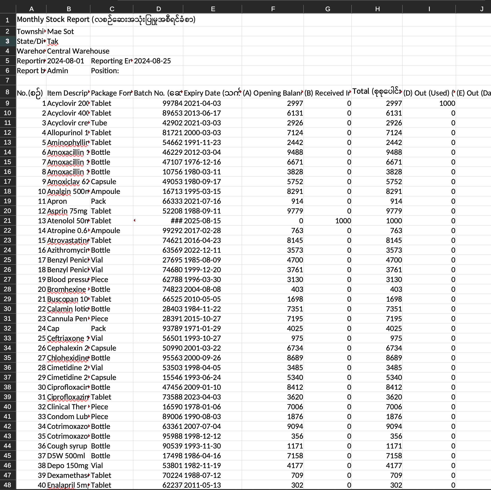
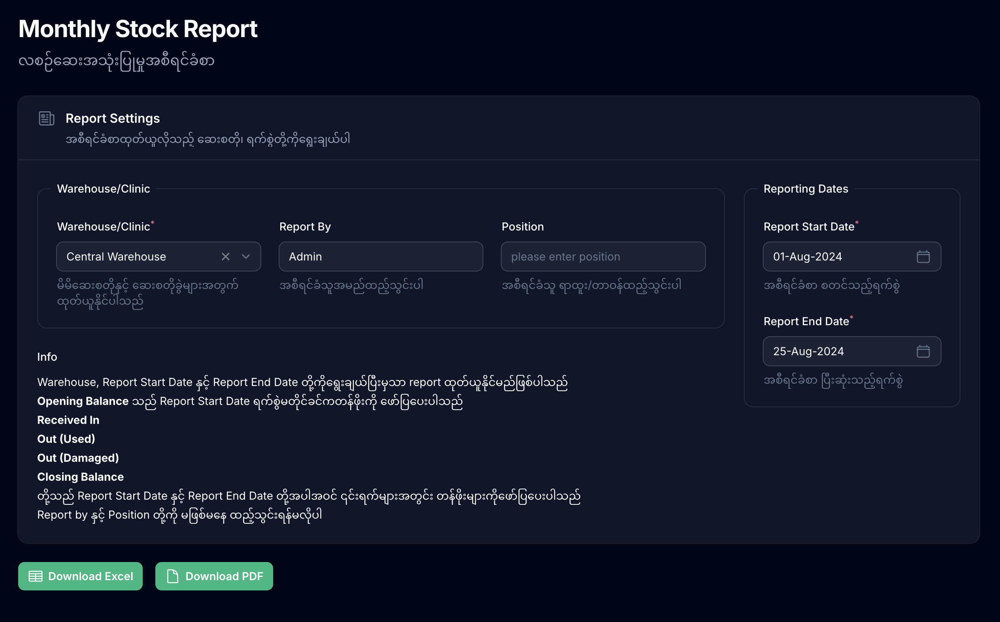

import { Image } from 'astro:assets';

အရင်တုန်းက မရေးတတ်ခဲ့တဲ့၊ ရေးဖို့ကိုလည်းမဖြစ်နိုင်ဘူးလို့ ငြင်းထားခဲ့တဲ့ report query လေးတစ်ခု ဒီ weekend မှာရေးဖြစ်ခဲ့တယ်။ ရေးရတဲ့ query က အကြောင်း ၄၀ လောက်ပဲဆိုပေမယ့် အဲဒီမတိုင်ခင် ဖတ်ရမှတ်ရတာက တော်တော်များတယ်။

<Image />

အရင်သွားတဲ့ပုံစံက
- အလုပ်လုပ် (work on the project)
- အခက်အခဲရှိရင် Google ရှာ၊ ChatGPT မေး (search or ask AI)
- ရလာတဲ့အဖြေကို ရှိပြီးသား knowledge နဲ့ပေါင်းစပ်ပြီး အခက်အခဲဖြေရှင်း (solve problems based on existing knowledge and search results)

ဒီနည်းကတင်စားပြောရရင် တိမ်တိုက်ထဲလေယာဉ်မောင်းနေသလိုပဲ။ တိမ်တိုက်နဲ့တိုးမိရင် လေယာဉ်မှာ turbulance steam ရတတ်သလိုမျိုး။ အခက်အခဲတွေကို တည့်တည့်ဝင်တိုးပြီး ဖြေရှင်းလိုက်၊ အခက်အခဲခဏလောက် ရှင်းသွားလိုက်၊ မကြာဘူးပြန်ရောက်လာလိုက်နဲ့ အလုပ်လုပ်ရတာ turbulance တွေနဲ့ကြုံရတယ်။
လေယာဉ်ကိုတိမ်တိုက်တွေထက်ပိုမြင့်တဲ့ altitude ဆီတက်ပြီးပျံမယ်ဆိုရင် လေထုသိပ်သည်းဆလျော့လာတာ၊ တိမ်တိုက်တွေလည်းနည်းလာတာကြောင့် ခရီးပိုတွင်သလို လောင်စာဆီလည်းသက်သာတယ်။
အဲဒီလိုပဲ ကိုယ့်မှာရှိပြီးသား knowledge ကိုလည်း နေ့စဉ်လုပ်ငန်းမှာလိုအပ်တဲ့ knowledge ထက်ပိုမြင့်နေအောင်မြှင့်ထားနိုင်မှ အလုပ်ပိုတွင်မယ်။ သက်သက်သာသာနဲ့အလုပ်ပြီးမယ်။
အလုပ်လုပ်ရတာ သက်သာတယ်ဆိုပေမယ့် အလုပ်လုပ်မနေတဲ့အချိန်မှာ စာချည်းထိုင်ဖတ်နေရတဲ့ အရင်းအနှီးကတော့ကြီးပါတယ်။ ပုံမှန် Google Search လောက်မှာမပါတဲ့အချက်အလက်တွေက စာအုပ်တွေထဲမှာပဲပါတာမို့ စာအုပ်တွေကိုအချိန်ပေးဖတ်ရတာမျိုးလည်းရှိပါတယ်။
ဒါပေမယ့် ပင်ပန်းခံပြီး အလုပ်လုပ်၊ စာမဖတ်ဘဲနေတာက ရေရှည်မှာအလုပ်ပြီးတာပဲရှိပြီး ကိုယ့်အတွက်မည်မည်ရရ ဘာမှမကျန်ခဲ့ပေမယ့် ပင်ပန်းခံပြီးစာဖတ်တာက အသိပညာတွေကျန်ခဲ့မှာပါ။

