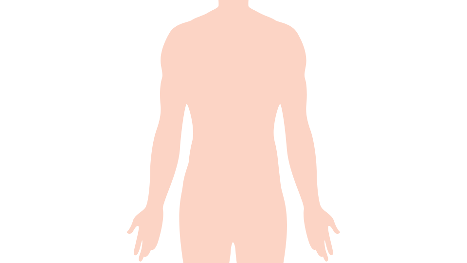
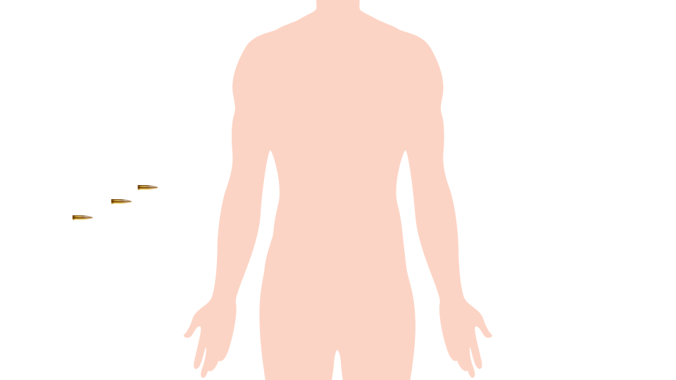
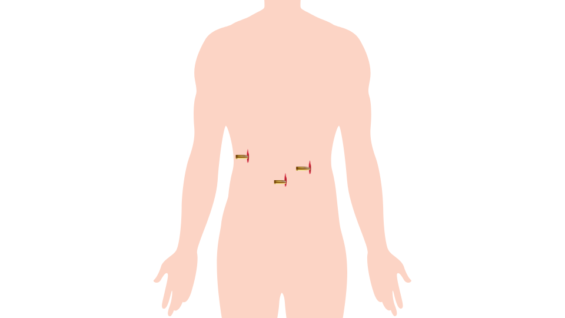
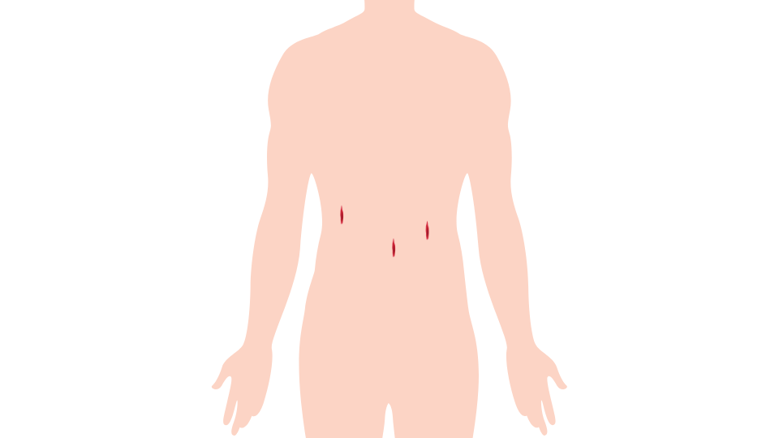
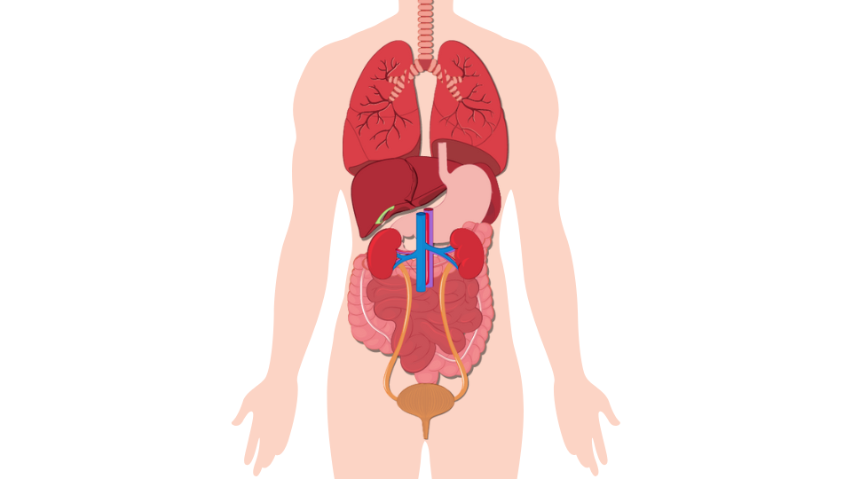
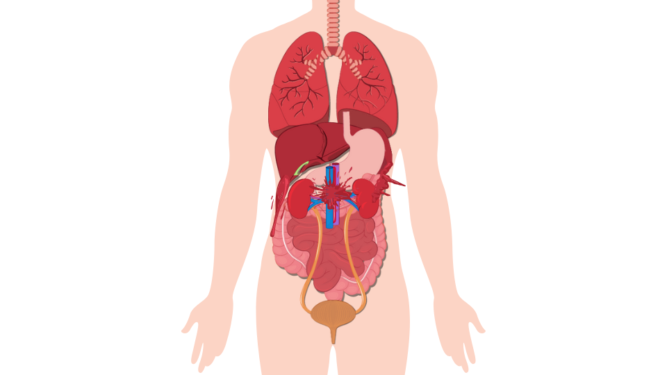
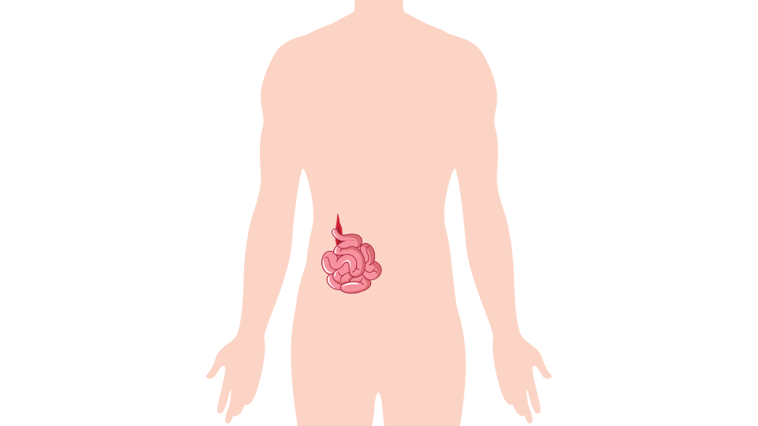

# Chapter04 Storyboard
## Injury to internal organs
|No.|Scene|Description|
|---|---|---|
|1.||Scene အစကို ယခုကဲ့သို့ anatomical position ဖြင့် ခန္ဓာကိုယ်တစ်ခုကိုပြပါ။ ဤပုံ၏ vector image ကို [Link](https://drive.google.com/file/d/1GxVe-QtiEEXb8_IMJdX-rnI_zk4eejq0/view?usp=sharing) တွင် ရယူနိုင်ပါသည်။|
|2.||ကျည်ဆံ (၃) တောင့် Scene ၏ ဘယ်ဘက်မှ အရှိန်ပြင်းစွာဝင်လာပါမည်။ ကျည်ဆံ၏ vector image ကို [Link](https://drive.google.com/file/d/1fUDx2y9nCazioHlLJK9WxEw_Or0YWzh9/view?usp=sharing) တွင်ရယူနိုင်ပါသည်|
|3.||ကျည်ဆံ (၃) တောင့်သည် ပုံတွင်ပြထားသည့်နေရာများတွင် ခန္ဓာကိုယ်အတွင်းသို့ ဖောက်ဝင်သွားပါမည်။ ဒဏ်ရာ၏ vector image ကို [Link](https://drive.google.com/file/d/1Uq6evpPH0WM96vYJrSrH_VCxP4keVbV4/view?usp=sharing) တွင်ရယူနိုင်ပါသည်|
|4.||ကျည်ဆံများဝင်ရောက်သွားပြီးနောက် ဒဏ်ရာ (၃) ပေါက် ကျန်ခဲ့ပါမည်။|
|5.||ကျည်ဆံဒဏ်ရာများ fade out ဖြင့်ပျောက်သွားသည်နှင့် တပြိုင်နက် ခန္ဓာကိုယ်ကလီစာများ fade in ဖြင့် ပေါ်လာပါမည်။ ကလီစာများ၏ vector image ကို [Link](https://drive.google.com/file/d/1fkAR5Hbx8Luj1Of6gFIEWEFS1ofbUmbU/view?usp=sharing) တွင်ရယူနိုင်ပါသည်။|
|6.||ခန္ဓာကိုယ်တွင်း ကျည်ဆံမှန်သွားသည့် ဒဏ်ရာများမှ သွေးများထွက်လာပါမည်။ အရေပြားကျည်ပေါက်ရာများနှင့် နီးစပ်သည့် အသည်း၊ ဘေလုံးနှင့် ဝမ်းဗိုက်သွေးလွှတ်ကြောများတွင် သွေးထွက်ဒဏ်ရာများပေါ်လာပါမည်။ သွေးထွက်ဒဏ်ရာများ၏ vector image ကို [Link](https://drive.google.com/file/d/1CLzEi3f6ozcn6eFYUln5R9aQCApYZ0L9/view?usp=sharing) တွင်ရယူနိုင်ပါသည်။|
***
## Open Abdominal Injury
|No.|Scene|Description|
|---|---|---|
|1.||Scene အစကို ယခုကဲ့သို့ anatomical position ဖြင့် ခန္ဓာကိုယ်တစ်ခုကိုပြပါ။ ဤပုံ၏ vector image ကို [Link](https://drive.google.com/file/d/1GxVe-QtiEEXb8_IMJdX-rnI_zk4eejq0/view?usp=sharing) တွင် ရယူနိုင်ပါသည်။|
|2.||ကျောက်ခဲတစ်လုံး လွင့်စင်လာပြီး ပုံတွင်ပြထားသည့်အတိုင်း ဝမ်းဗိုက်ကိုလာရောက်ထိမှန်ပါမည်။ ဗိုက်ကိုထိသည်နှင့် ဒဏ်ရာပေါ်လာပြီး ကျောက်ခဲသည် အောက်သို့ပြုတ်ကျသွားပါမည်။ ကျောက်ခဲ၏ vector image ကို [Link](https://drive.google.com/file/d/1ABKxH7CW47CYQhXucEVdMuT0tnGow3uF/view?usp=sharing) တွင်ရယူနိုင်ပါသည်။|
|3.||ဝမ်းဗိုက်ဒဏ်ရာမှ အူများထွက်ကျလာပါမည်။ အူများထွက်ကျလာသည့် animation ကို fade in ဖြင့်လည်းပြုလုပ်နိုင်ပါသည်။ အူများ၏ vector image ကို [Link](https://drive.google.com/file/d/1sS0sNqCwtvgIRW-fbspgg4PFsqUgOIrw/view?usp=sharing) တွင်ရယူနိုင်ပါသည်။|
|4.||အူများထွက်ကျနေသည့်ဒဏ်ရာပတ်ဝန်းကျင်ကို ဆေးကြောနေသည့်ပုံပြပါ။ ယခင်အောက်ခံပုံနှင့်အူထွက်ကျနေပုံကို ဆက်သုံးနိုင်ပါသည် (သို့) လဲကျနေသည့်လူပုံစံကို အသစ်ပြန်လည်ရေးဆွဲလျှင်လည်းရပါသည်။ ယခုရှုထောင့်အတိုင်း အပေါ်စီးမှ မြင်ရသည့်ပုံစံရေးဆွဲနိုင်သလို သင့်တော်သည့်ရှုထောင့်မှလည်း ရေးဆွဲနိုင်ပါသည်|
|5.||ပတ်တီးစအသန့်ကို ရေစွတ်နေသည့်ပုံစံ ပြပေးပါ|
|6.||ဒဏ်ရာပေါ်မှ ပတ်တီးစကိုအုပ်ပါ|
|7.||ပတ်တီးစ၏ အောက်ဘက်အနားပေါ်တွင် နောက်ထပ်ပတ်တီးစတစ်ခု ထပ်အုပ်ပါ|
|8.||ပတ်တီးစ၏ အပေါ်ဘက်အနားပေါ်တွင် နောက်ထပ်ပတ်တီးစတစ်ခု ထပ်အုပ်ပါ|
|9.||ပတ်တီးစများပေါ်သို့ ရေဆွတ်ပေးပါ|
|10.||ပလတ်စတစ်စကို ပတ်တီးစများပေါ်မှအုပ်ပေးပါ|
|11.||ပလတ်စတစ်စ အနားစွန်းများကိုတိပ်နှင့်ကပ်၍ ပိတ်ပေးပါ။|
|12.||ကပ်ပြီးသည့်အခါ ယခုပုံစံအတိုင်းရရှိပါမည်။|
|13.||ထိုအပေါ်သို့ ပတ်တီးခေါက်နှစ်ခုကို ဘယ်ညာတစ်ခုစီ တင်ပေးပါ|
|14.||၎င်းအပေါ်မှပတ်တီးစည်းပါ။|
|15.||ပတ်တီးစည်းပြီးသည့်အခါ ယခုကဲ့သို့ရရှိပါမည်။ ပတ်တီးနှင့် ခန္ဓာကိုယ်ကြားထဲသို့ Drip ပိုက်တန်းလန်းကျနေသည့် အပိုင်းကို ညှပ်ထားပေးပါ။ Drip ၏ vector image ကို [Link](https://drive.google.com/file/d/1ln6rnwq3JVEsQN53k61h6LZZqbwq3Yr8/view?usp=sharing) တွင် ရယူနိုင်ပါသည်။|
***
## Impaled Object
|No.|Scene|Description|
|---|---|---|
|1.||ဝမ်းဗိုက်စိုက်ဝင်ဒဏ်ရာအတွက် ရှုထောင့် (angle of view) ကို မိမိနှစ်သက်သည့်အနေအထားအတိုင်း ရေးဆွဲနိုင်ပါသည်။ ဝမ်းဗိုက်တွင် စိုက်ဝင်နေသည့် ဒဏ်ရာပတ်ဝန်းကျင်တွင် ရေဆွတ်ထားသည့် ပတ်တီးစဖြင့် သန့်ရှင်းပေးပါ။ |
|2.||ဒဏ်ရာပတ်ဝန်းကျင်တွင် ပတ်တီးခေါက်ထူထူများဖြင့် ဝန်းရံပြီးနေရာချပါ။|
|3.||ဒဏ်ရာ၏လေးဘက်လေးတန်တွင် ပတ်တီးခေါက်များနေရာချပေးပါ|
|4.||ပတ်တီးများပေါ်မှ တိပ်ကပ်ပေးပါ|
|5.||စိုက်ဝင်နေသည့်ပစ္စည်းပေါ်မှ ခွက် (သို့) စက္ကူဘူးခွံတစ်ခုကို အုပ်ထားပေးပါ။|
|6.||၎င်းအပေါ်မှ တိပ်ကပ်ပေးပါ|
|7.||ပတ်တီးဖြင့် အပေါ်မှပတ်၍စည်းပေးပါ|
|8.||ပတ်တီးစည်းပြီးသည့်အခါ ယခုပုံအတိုင်းရရှိပါမည်|